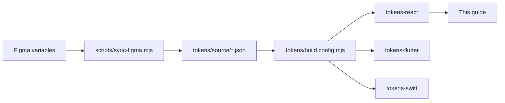

import { Hero, Features, Preview, Stats } from '../components/Landing';

<Hero />

<Features />

<Preview />

<Stats />

## How it works



- **Figma is the source of truth.** Designers change tokens in the Figma
  library; `FIGMA_TOKEN=… node scripts/sync-figma.mjs` mirrors them to
  `tokens/source/*.json`.
- **`pnpm build:tokens`** regenerates all three language outputs from
  `tokens/source/`. Generated files live under `packages/tokens-*/…/generated`
  and are never edited by hand.
- **This guide** consumes the React output live, and shows Flutter/Swift
  snippets as code tabs.

## Get started

```bash
# In your React project
pnpm add @origon/react @origon/tokens-react

# In your Flutter project (add to pubspec.yaml)
origon_ui:
  path: /path/to/compo/packages/flutter

# In your Swift package (Package.swift)
.package(path: "/path/to/compo/packages/swift"),
```

Then browse [Foundations](/foundations/colors) or dive into
[Components](/components/button).
